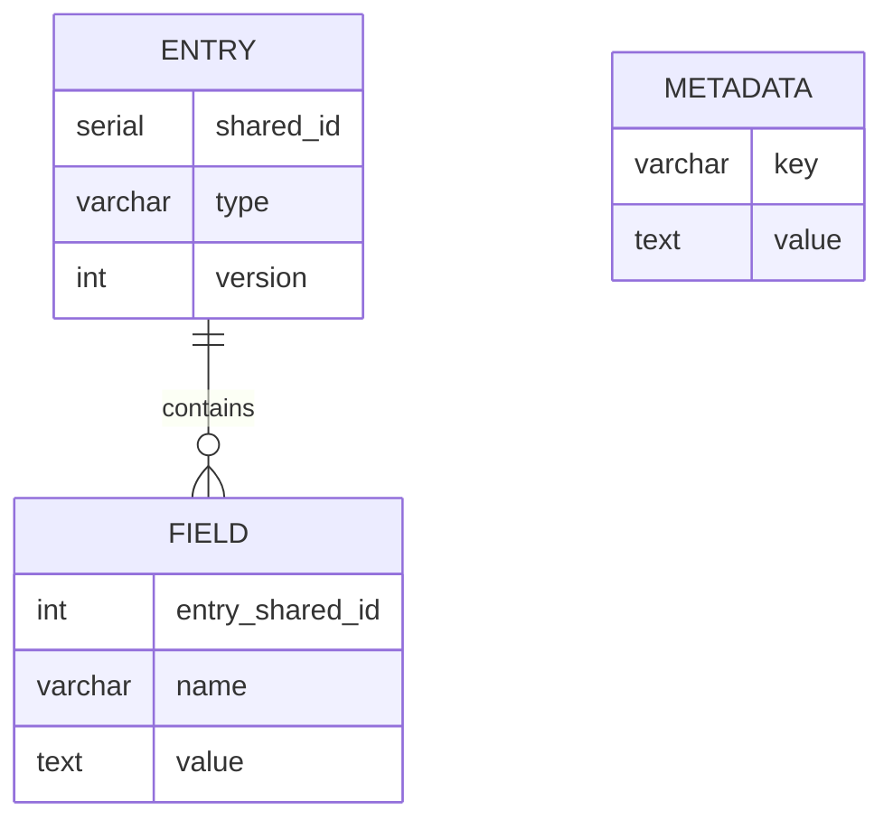

## Intellij


## IntelliJ Hints

{: .highlight }
Did you know that [IntelliJ allows for reformatting selected code](https://www.jetbrains.com/help/idea/reformat-and-rearrange-code.html#reformat_code) if you press <kbd>Ctrl</kbd> + <kbd>Alt</kbd> + <kbd>L</kbd>?

### Key hints for IntelliJ

* <kbd>Shift</kbd>+<kbd>Shift</kbd> (AKA double-shift): Open the search dialog.
* <kbd>Ctrl</kbd>+<kbd>N</kbd>: Open the search dialog and select search for a class.
* <kbd>Ctrl</kbd>+<kbd>Shift</kbd>+<kbd>F</kbd>: Search everywhere in the code base.
* <kbd>Alt</kbd>+<kbd>F1</kbd> and then <kbd>Enter</kbd>: Locate the file in the search bar on the left side.
* <kbd>Ctrl</kbd>+<kbd>Shift</kbd>+<kbd>T</kbd>: Navigate from a class to the test class.

### Show variable values in IntelliJ

1. Go to a test case (example: [`org.jabref.model.entry.BibEntryTest#settingTypeToNullThrowsException`](https://github.com/JabRef/jabref/blob/main/src/test/java/org/jabref/model/entry/BibEntryTest.java#L52-L52)
2. Set the breakpoint to the first line
3. Execute the test
4. Go to the settings of the debugger and activate "Show Variable Values in Editor" and "Show Method Return Values"
   <figure>
     
     <figcaption>Debugger Configuration</figcaption>
   </figure>

<!-- markdownlint-disable-file MD033 -->


## Bibtex


## JabRef's handling of BibTeX

The main class to handle a single BibTeX entry is `org.jabref.model.entry.BibEntry`.
The content of a `.bib` file is handled in `org.jabref.model.database.BibDatabase`.
The BibTeX contents (as in the `BibDatabase`) along with some metadata required for handling are stored in `org.jabref.model.database.BibDatabaseContext`.
For instance, this stores the mode of the library, which can be BibTeX or `biblatex`.

Standard BibTeX fields known to JabRef are modeled in `org.jabref.model.entry.field.StandardField`.
A user-defined field not known to JabRef's code is modelled in `org.jabref.model.entry.field.UnknownField`.
Typically, to get from a String to a `Field`, one needs to use `org.jabref.model.entry.field.FieldFactory#parseField(java.lang.String)`.

Reading of `.bib` files is done in `org.jabref.logic.importer.fileformat.BibtexImporter`.

### Cross-references

BibTeX allows for referencing other entries by the field `crossref` (`org.jabref.model.entry.field.StandardField#CROSSREF`).
Note that BibTeX and `biblatex` handle this differently.
The method `org.jabref.model.entry.BibEntry#getResolvedFieldOrAlias(org.jabref.model.entry.field.Field, org.jabref.model.database.BibDatabase)` handles this difference.


## Cli


## Command Line Interface

The module `jabkit` is mainly responsible for handling the command line options. The module `jabgui` also provides some rudimentary functionality, mainly responsible for command line interaction with the gui.

In both modules, the package `org.jabref.cli` uses the PicoCli library to process arguments.

During development, one can configure IntelliJ to pass command line parameters:


Passing command line arguments using gradle is possible by adding the arguments to the run command with the `--args` option.


Without [jlink](https://docs.oracle.com/en/java/javase/11/tools/jlink.html), it is not possible to generate a fat jar anymore. During development, the capabilities of the IDE has to be used.


## Code Quality


## Code Quality

### Code style checkers

JabRef has three code style checkers in place:

* [Checkstyle](https://checkstyle.sourceforge.io/) for basic checks, such as wrong import order.
* [Gradle Modernizer Plugin](https://github.com/andygoossens/gradle-modernizer-plugin#gradle-modernizer-plugin) for Java library usage checks.
  It ensures that "modern" Java concepts are used (e.g., [one should use `Deque` instead of `Stack`](https://stackoverflow.com/a/73021741/873282)).
* [OpenRewrite](https://docs.openrewrite.org/) for advanced rules. OpenRewrite can also automatically fix issues.
  JabRef's CI toolchain does NOT automatically rewrite the source code, but checks whether OpenRewrite would rewrite something.
  As developer, one can execute `./gradlew rewriteRun` to fix the issues.
  Note that [JabRef is available on the Moderne platform](https://app.moderne.io/organizations/JabRef/jabref?branch=main&origin=github.com), too.

In case a check fails, [the CI](https://github.com/JabRef/jabref/blob/main/.github/workflows/tests.yml#L24C6-L24C6) automatically adds a comment on the pull request.

### Monitoring

We monitor the general source code quality at three places:

* [codacy](https://www.codacy.com) is a hosted service to monitor code quality. It thereby combines the results of available open source code quality checkers such as [Checkstyle](https://checkstyle.sourceforge.io) or [PMD](https://pmd.github.io). The code quality analysis for JabRef is available at [https://app.codacy.com/gh/JabRef/jabref/dashboard](https://app.codacy.com/gh/JabRef/jabref/dashboard), especially the [list of open issues](https://app.codacy.com/gh/JabRef/jabref/issues/index). In case a rule feels wrong, it is most likely a PMD rule.
* [codecov](https://codecov.io) is a solution to check code coverage of test cases. The code coverage metrics for JabRef are available at [https://codecov.io/github/JabRef/jabref](https://codecov.io/github/JabRef/jabref).
* [Teamscale](https://www.cqse.eu/en/teamscale/overview/) is a popular German product analyzing code quality. The analysis results are available at <https://demo.teamscale.com/findings.html#/jabref/?>.

### Up to date dependencies

We believe that updated dependencies are a sign of maintained code and thus an indicator of good quality.
We use [GitHub's dependabot](https://docs.github.com/en/code-security/getting-started/dependabot-quickstart-guide) to keep our versions up to date.

Moreover, we try to test JabRef with the latest Java Development Kit (JDK) builds.
Our results can be seen at the [Quality Outreach page](https://wiki.openjdk.org/display/quality/Quality+Outreach).

### Statistics

* [](https://github.com/JabRef/jabref/actions?query=workflow%3ATests)
* [](https://codecov.io/github/JabRef/jabref?branch=main)

### Background literature

We strongly recommend reading following two books on code quality:

* [Java by Comparison](http://java.by-comparison.com) is a book by three JabRef developers which focuses on code improvements close to single statements. It is fast to read and one gains much information from each recommendation discussed in the book.
* [Effective Java](https://www.oreilly.com/library/view/effective-java-3rd/9780134686097/) is the standard book for advanced Java programming. Did you know that `enum` is the [recommended way to enforce a singleton instance of a class](https://learning.oreilly.com/library/view/effective-java-3rd/9780134686097/ch2.xhtml#lev3)? Did you know that one should [refer to objects by their interfaces](https://learning.oreilly.com/library/view/effective-java-3rd/9780134686097/ch9.xhtml#lev64)?

The principles we follow to ensure high code quality in JabRef is stated at our [Development Strategy](../getting-into-the-code/development-strategy.md).


## Custom Svg Icons


## Custom SVG icons

JabRef uses [Material Design Icons](https://materialdesignicons.com) for most buttons on toolbars and panels. While most required icons are available, some specific ones cannot be found in the standard set, like Vim, Emacs, etc. Although custom icons might not fit the existing icons perfectly in style and level of detail, they will fit much better into JabRef than having a color pixel icon between all Material Design Icons.


This tutorial aims to describe the process of adding missing icons created in a vector drawing tool like Adobe Illustrator and packing them into a _true type font_ (TTF) to fit seamlessly into the JabRef framework.

The process consists of 5 steps:

1. Download the template vector graphics from the Material Design Icons webpage. This gives you a set of existing underlying shapes that are typically used and the correct bounding boxes. You can design the missing icon based on this template and export it as an SVG file.
2. Pack the set of icons into a TTF with the help of the free IcoMoon tool.
3. Replace the existing `JabRefMaterialDesign.ttf` in the `src/main/resources/fonts` folder.
4. Adapt the class `org.jabref.gui.JabRefMaterialDesignIcon` to include all icons.
5. Adapt the class `org.jabref.gui.IconTheme` to make the new icons available in JabRef

### Step 1. Designing the icon

Good icon design requires years of experience and cannot be covered here. Adapting color icons with a high degree of detail to look good in the flat, one-colored setting is an even harder task. Therefore, only 3 tips: 1. Look up some tutorials on icon design, 2. reuse the provided basic shapes in the template, and 3. export your icon in the SVG format.

### Step 2. Packing the icons into a font

Use the [IcoMoon](https://icomoon.io) tool for packing the icons.

1. Create a new set by importing the json file [JabRefMaterialDesign.json.zip](https://github.com/user-attachments/files/16617468/JabRefMaterialDesign.json.zip)

2. Next to the icons, click on the hamburger menu, chose "Import to Set" to add a new icon (it will be added to the front)
Rearrange them so that they have the same order as in `org.jabref.gui.JabRefMaterialDesignIcon`. This will avoid that you have to change the code points for the existing glyphs. In the settings for your icon set, set the _Grid_ to 24. This is important to get the correct spacing. The name of the font is `JabRefMaterialDesign`.
3. Next to the icons, click on the hamburger menu and click "Select all".
4. Proceed with the font creating, set the font property name to `JabRefMaterialDesign`
When your icon-set is ready, select all of them and download the font-package.

### Step 3. Replace the existing `JabRefMaterialDesign.ttf`

Unpack the downloaded font-package and copy the `.ttf` file under `fonts` to `src/main/resources/fonts/JabRefMaterialDesign.ttf`.

### Step 4. Adapt the class `org.jabref.gui.JabRefMaterialDesignIcon`

Inside the font-package will be a CSS file that specifies which icon (glyph) is at which code point. If you have ordered them correctly, you newly designed icon(s) will be at the end and you can simply append them to `org.jabref.gui.JabRefMaterialDesignIcon`:

```java
    TEX_STUDIO("\ue900"),
    TEX_MAKER("\ue901"),
    EMACS("\ue902"),
    OPEN_OFFICE("\ue903"),
    VIM("\ue904"),
    LYX("\ue905"),
    WINEDT("\ue906"),
    ARXIV("\ue907");
```

### Step 5. Adapt the class `org.jabref.gui.IconTheme`

If you added an icon that already existed (but not as flat Material Design Icon), then you need to change the appropriate line in `org.jabref.gui.IconTheme`, where the icon is assigned. If you created a new one, then you need to add a line. You can specify the icon like this:

```java
APPLICATION_EMACS(JabRefMaterialDesignIcon.EMACS)
```


## Docker

## Docker images offered by JabRef

### JabKit

`Dockerfile.jabkit`

Building locally:

    docker build -f Dockerfile.jabkit -t jabkit:latest .

Running locally:

     docker run --rm -it jabkit:latest --help

### JabSrv

`Dockerfile.jabsrv`

Building locally:

    docker build -f Dockerfile.jabsrv -t jabkit:latest .

Running locally:

    docker run --rm -it -p 6050:6050 jabsrv:latest -h 0.0.0.0


## Error Handling


## Error Handling in JabRef

### Throwing and Catching Exceptions

Principles:

* All exceptions we throw should be or extend `JabRefException`; This is especially important if the message stored in the Exception should be shown to the user. `JabRefException` has already implemented the `getLocalizedMessage()` method which should be used for such cases (see details below!).
* Catch and wrap all API exceptions (such as `IOExceptions`) and rethrow them
  * Example:

    ```java
        try {
            // ...
        } catch (IOException ioe) {
            throw new JabRefException("Something went wrong...",
                Localization.lang("Something went wrong...", ioe);
        }
    ```

* Never, ever throw and catch `Exception` or `Throwable`
* Errors should only be logged when they are finally caught (i.e., logged only once). See **Logging** for details.
* If the Exception message is intended to be shown to the User in the UI (see below) provide also a localizedMessage (see `JabRefException`).

_(Rationale and further reading:_ [https://www.baeldung.com/java-exceptions](https://www.baeldung.com/java-exceptions)_)_

### Outputting Errors in the UI

Principle: Error messages shown to the User should not contain technical details (e.g., underlying exceptions, or even stack traces). Instead, the message should be concise, understandable for non-programmers and localized. The technical reasons (and stack traces) for a failure should only be logged.

To show error message two different ways are usually used in JabRef:

* showing an error dialog
* updating the status bar at the bottom of the main window

```text
TODO: Usage of status bar and `DialogService`
```


## Eventbus


## Event Bus and Event System

### What the EventSystem is used for

Many times there is a need to provide an object on many locations simultaneously. This design pattern is quite similar to Java's Observer, but it is much simpler and readable while having the same functional sense.

### Main principle

`EventBus` represents a communication line between multiple components. Objects can be passed through the bus and reach the listening method of another object which is registered on that `EventBus` instance. Hence, the passed object is available as a parameter in the listening method.

### Register to the `EventBus`

Any listening method has to be annotated with `@Subscribe` keyword and must have only one accepting parameter. Furthermore, the object which contains such listening method(s) has to be registered using the `register(Object)` method provided by `EventBus`. The listening methods can be overloaded by using different parameter types.

### Posting an object

`post(object)` posts an object through the `EventBus` which has been used to register the listening/subscribing methods.

### Short example

```java
/* Listener.java */

import com.google.common.eventbus.Subscribe;

public class Listener {

   private int value = 0;

   @Subscribe
   public void listen(int value) {
      this.value = value;
   }

   public int getValue() {
      return this.value;
   }
}
```

```java
/* Main.java */

import com.google.common.eventbus.EventBus;

public class Main {
   private static EventBus eventBus = new EventBus();

   public static void main(String[] args) {
      Main main = new Main();
      Listener listener = new Listener();
      eventBus.register(listener);
      eventBus.post(1); // 1 represents the passed event

      // Output should be 1
      System.out.println(listener.getValue());
   }
}
```

### Event handling in JabRef

The `event` package contains some specific events which occur in JabRef.

For example: Every time an entry was added to the database a new `EntryAddedEvent` is sent through the `eventBus` which is located in `BibDatabase`.

If you want to catch the event you'll have to register your listener class with the `registerListener(Object listener)` method in `BibDatabase`. `EntryAddedEvent` provides also methods to get the inserted `BibEntry`.

### Throttling events

There is `CoarseChangeFilter` which filters out events (e.g., typing in the same field) that are sent too frequently.
It is used to prevent the event bus from being flooded with events that are too close together in time.
The `LibraryTab` offers an instance where subscribers in the UI should use.


## Faq


## Frequently Asked Questions (FAQ)

Following is a list of common errors encountered by developers which lead to failing tests, with their common solutions:

### git hints

* Sync your fork with the JabRef repository: [General howto by GitHub](https://help.github.com/articles/syncing-a-fork/)
* Branches and pull requests (🇩🇪): [https://github.com/unibas-marcelluethi/software-engineering/blob/master/docs/week2/exercises/practical-exercises.md](https://github.com/unibas-marcelluethi/software-engineering/blob/master/docs/week2/exercises/practical-exercises.md)

### Failing GitHub workflow "Sync fork with upstream"

To ease development, a GitHub workflow automatically updates your `main` branch daily.
However, it is not allowed to update your files if the GitHub workflows are updated by the JabRef team.
Therefore, GitHub notifies you now and then that "Sync fork with upstream failed for main branch".

To solve this issue, open your GitHub repository in your browser.
Then, click "Sync fork" to get your fork up-to-date and get the workflow passing again.


### Failing tests

#### Failing <b>Checkstyle</b> tests

JabRef follows a pre-defined style of code for uniformity and maintainability that must be adhered to during development. To set up warnings and auto-fixes conforming to these style rules in your IDE, follow [Step 3](https://devdocs.jabref.org/getting-into-the-code/guidelines-for-setting-up-a-local-workspace/intellij-13-code-style.html) of the process to set up a local workspace in the documentation. Ideally, follow all the [set up rules](https://devdocs.jabref.org/getting-into-the-code/guidelines-for-setting-up-a-local-workspace/) in the documentation end-to-end to avoid typical set-up errors.<br> <b>Note</b>: The steps provided in the documentation are for IntelliJ, which is the preferred IDE for Java development. The `checkstyle.xml` is also available for VSCode, in the same directory as mentioned in the steps.

#### Failing <b>OpenRewrite</b> tests

Execute the Gradle task `rewriteRun` from the `rewrite` group of the Gradle Tool window in IntelliJ to apply the automated refactoring and pass the test:<br>


Background: [OpenRewrite](https://docs.openrewrite.org/) is an automated refactoring ecosystem for source code.

#### `org.jabref.logic.l10n.LocalizationConsistencyTest findMissingLocalizationKeys` <span style="color:red">FAILED</span>

You have probably used Strings that are visible on the UI (to the user) but not wrapped them using `Localization.lang(...)` and added them to the [localization properties file](https://github.com/JabRef/jabref/blob/main/src/main/resources/l10n/JabRef_en.properties).

Read more about the [background and format of localization](https://devdocs.jabref.org/code-howtos/localization.html) in JabRef.

#### `org.jabref.logic.l10n.LocalizationConsistencyTest findObsoleteLocalizationKeys` <span style="color:red">FAILED</span>

Navigate to the unused key-value pairs in the file and remove them.
You can always click on the details of the failing test to pinpoint which keys are unused.

Background: There are localization keys in the [localization properties file](https://github.com/JabRef/jabref/blob/main/src/main/resources/l10n/JabRef_en.properties) that are not used in the code, probably due to the removal of existing code.
Read more about the [background and format of localization](https://devdocs.jabref.org/code-howtos/localization.html) in JabRef.

#### `org.jabref.logic.citationstyle.CitationStyleCatalogGenerator generateCitationStyleCatalog` <span style="color:red">ERROR: Could not find any citation style. Tried with /ieee.csl.</span>

Check the directory `jablib/src/main/resources/csl-styles`.
If it is missing or empty, run `git submodule update`.
Now, check inside if `ieee.csl` exists.
If it does not, run `git reset --hard` **inside that directory**.

#### `java.lang.IllegalArgumentException`: Unable to load locale en-US <span style="color:red">ERROR: Could not generate BibEntry citation. The CSL engine could not create a preview for your item.</span>

Check the directory `jablib/src/main/resources/csl-locales`.
If it is missing or empty, run `git submodule update`.
If still not fixed, run `git reset --hard` **inside that directory**.

#### `org.jabref.support.CommonArchitectureTest restrictStandardStreams` <span style="color:red">FAILED</span>

Check if you've used `System.out.println(...)` (the standard output stream) to log anything into the console.
This is an architectural violation, as you should use the Logger instead for logging.
More details on [how to log](https://devdocs.jabref.org/code-howtos/logging.html).

#### `org.jabref.support.CommonArchitectureTest doNotUseLogicInModel` <span style="color:red">FAILED</span>

One common case when this test fails is when you put any class purely containing business logic inside the `model` package (i.e., inside the directory `org/jabref/model/`).
To fix this, shift the class to a sub-package within the `logic` package (i.e., the directory`org/jabref/logic/`).
An efficient way to do this is to use IntelliJ's built-in refactoring capabilities - right-click on the file, go to "Refactor" and use "Move Class".
The import statement for all the classes using this class will be automatically adjusted according to the new location.<br>
<br>

More information on the architecture can be found at [../getting-into-the-code/high-level-documentation.md](High-level documentation).

#### `Check external href links in the documentation / check-links (push)` <span style="color:red">FAILED</span>

This test is triggered when any kind of documentation is touched (be it the JabRef docs, or JavaDoc in code). If you changed something in the documentation, and particularly added/changed any links (to external files or websites), check if the links are correct and working. If you didn't change/add any link, or added correct links, the test is most probably failing due to any of the existing links being broken, and thus can be ignored (in the context of your contribution).

#### Failing <b>Fetcher</b> tests

Fetcher tests are run when any file in the `.../fetcher` directory has been touched. If you have changed any fetcher logic, check if the changes are correct. You can look for more details on how to locally [run fetcher tests](https://devdocs.jabref.org/code-howtos/testing.html#fetchers-in-tests).
Otherwise, since these tests depend on remote services, their failure can also be caused by the network or an external server, and thus can be ignored in the context of your contribution. For more information, you can look at [commiting and pushing changes to fetcher tests](https://devdocs.jabref.org/code-howtos/fetchers.html#committing-and-pushing-changes-to-fetcher-files).

### Gradle outputs

#### `ANTLR Tool version 4.12.0 used for code generation does not match the current runtime version 4.13.1`

Execute the Gradle task `clean` from the `build` group of the Gradle Tool Window in IntelliJ:<br>
<br>

#### `BstVMVisitor.java:157: error: package BstParser does not exist`

Execute gradle task `clean` from the `build` group of the Gradle Tool Window in IntelliJ.

#### `No test candidates found`

You probably chose the wrong gradle task:

<br>

### Submodules

#### The problem

Sometimes, when contributing to JabRef, you may see `abbrv.jabref.org`, `csl-styles` or `csl-locales` among the changed files in your pull request. This means that you have accidentally committed your local submodules into the branch.


#### Context

JabRef needs external submodules (such as CSL style files) for some of its respective features. These are cloned once when you set up a local development environment, using `--recurse-submodules` (you may have noticed). These submodules, in the main branch, are automatically periodically updated but not fetched into local again when you pull, as they are set to be ignored in `.gitmodules` (this is to avoid merge conflicts). So when remote has updated submodules, and your local has the old ones, when you stage all files, these changes are noticed.  
What's strange (mostly an IntelliJ bug): Regardless of CLI or GUI, These changes should ideally not be noticed on staging, as per the `.gitmodules` configuration. However, that is somehow overruled when using IntelliJ's CLI.
  
#### Fix

For `csl-styles`, `csl-locales`, and `abbrev.jabref.org`:

```bash
git merge origin/main
git checkout main -- jablib/src/main/resources/csl-styles
git checkout main -- jablib/src/main/resources/csl-locales
git checkout main -- jablib/src/main/abbrv.jabref.org
git commit -m "Fix submodules"
git push
```

##### Alternative method (if the above doesn't work)

1. Edit `.gitmodules`: comment out `ignore = all` (for the respective submodules you are trying to reset)

    ```gitignore
    # ignore = all
    ```

2. `cd` into the changed submodules directory (lets say `csl-styles` was changed):

    ```bash
    cd jablib/src/main/resources/csl-styles
    ```

3. Find the latest submodule commit id from remote (github):

    

    Here, in the case of `csl-styles`, it is `4e0902d`.

4. Checkout the commit:

    ```bash
    git checkout 4e0902d
    ```

5. Now, IntelliJ's commit tab will notice that the submodules have been modified. This means we are on the right track.

6. Use IntelliJ's git manager (commit tab) or `git gui` to commit submodule changes only. Repeat steps 2-5 for other submodules that are shown as modified in the PR. Then, push these changes.

7. Revert the changes in `.gitmodules` (that you made in step 1).

#### Prevention

To avoid this, avoid staging using `git add .` from CLI. Preferably use a GUI-based git manager, such as the one built in IntelliJ or open git gui from the command line. Even if you accidentally stage them, don't commit all files, selectively commit the files you touched using the GUI based tool, and push.

### Q: I get `java: package org.jabref.logic.journals does not exist`

A: You have to ignore `buildSrc/src/main` as source directory in IntelliJ as indicated in our [setup guide](https://devdocs.jabref.org/getting-into-the-code/guidelines-for-setting-up-a-local-workspace).

Also filed as IntelliJ issue [IDEA-240250](https://youtrack.jetbrains.com/issue/IDEA-240250).

<!-- markdownlint-disable-file MD033 -->


## Fetchers


## Fetchers

Fetchers are the implementation of the [search using online services](https://docs.jabref.org/collect/import-using-online-bibliographic-database). Some fetchers require API keys to get them working. To get the fetchers running in a JabRef development setup, the keys need to be placed in the respective environment variable. The following table lists the respective fetchers, where to get the key from and the environment variable where the key has to be placed.

| Service                                                                                                                                           | Key Source                                                                                                     | Environment Variable           | Rate Limit                       |
|:--------------------------------------------------------------------------------------------------------------------------------------------------|----------------------------------------------------------------------------------------------------------------|--------------------------------|----------------------------------|
| [Biodiversity Heritage Library](https://www.biodiversitylibrary.org/)                                                                             | [Biodiversitylibrary](https://about.biodiversitylibrary.org/tools-and-services/developer-and-data-tools/#APIs) | `BiodiversityHeritageApiKey`   | -                                |
| [IEEEXplore](https://docs.jabref.org/collect/import-using-online-bibliographic-database#ieeexplore)                                               | [IEEE Xplore API portal](https://developer.ieee.org)                                                           | `IEEEAPIKey`                   | 200 calls/day                    |
| [Medline/Pubmed](https://pubmed.ncbi.nlm.nih.gov/)                                                                                                | [NCBI User account](https://account.ncbi.nlm.nih.gov/settings/)                                                | `medlineApiKey`                | 10 requests/seconds              |
| [MathSciNet](http://www.ams.org/mathscinet)                                                                                                       | (none)                                                                                                         | (none)                         | Depending on the current network |
| [SAO/NASA Astrophysics Data System](https://docs.jabref.org/collect/import-using-online-bibliographic-database#sao-nasa-astrophysics-data-system) | [ADS UI](https://ui.adsabs.harvard.edu/user/settings/token)                                                    | `AstrophysicsDataSystemAPIKey` | 5000 calls/day                   |
| [ScienceDirect](https://www.sciencedirect.com)                                                                                                    |                                                                                                                | `ScienceDirectApiKey`          |                                  |
| [SemanticScholar](https://www.semanticscholar.org/)                                                                                               | <https://www.semanticscholar.org/product/api#api-key-form>                                                     | `SemanticScholarApiKey`        |                                  |
| [Springer Nature](https://docs.jabref.org/collect/import-using-online-bibliographic-database#springer)                                            | [Springer Nature API portal](https://dev.springernature.com). Use the "Meta API" API key.                      | `SpringerNatureAPIKey`         | 5000 calls/day                   |
| [Zentralblatt Math](https://www.zbmath.org)                                                                                                       | (none)                                                                                                         | (none)                         | Depending on the current network |

"Depending on the current network" means that it depends on whether your request is routed through a network having paid access. For instance, some universities have subscriptions to MathSciNet.

On Windows, you have to log off and log on to let IntelliJ know about the environment variable change. Execute the gradle task `processResources` in the group "others" within IntelliJ to ensure the values have been correctly written. Now, the fetcher tests should run without issues.

JabRef supports different kinds of fetchers:

* `EntryBasedFetcher`: Completes an existing bibliographic entry with information retrieved by the fetcher
* `FulltextFetcher`: Searches for a PDF for an exiting bibliography entry
* `SearchBasedFetcher`: Searches providers using a given query and returns a set of (new) bibliography entry. The user-facing side is implemented in the UI described at [https://docs.jabref.org/collect/import-using-online-bibliographic-database](https://docs.jabref.org/collect/import-using-online-bibliographic-database).

There are more fetchers supported by JabRef. Investigate the package `org.jabref.logic.importer`. Another possibility is to investigate the inheritance relation of `WebFetcher` (Ctrl+H in IntelliJ).

### Fulltext Fetchers

* all fulltext fetchers run in parallel
* the result with the highest priority wins
* `InterruptedException` | `ExecutionException` | `CancellationException` are ignored

#### Trust Levels

* `SOURCE` (highest): definitive URL for a particular paper
* `PUBLISHER`: any publisher library
* `PREPRINT`: any preprint library that might include non final publications of a paper
* `META_SEARCH`: meta search engines
* `UNKNOWN` (lowest): anything else not fitting the above categories

#### Current trust levels

All fetchers are contained in the package `org.jabref.logic.importer.fetcher`. Here we list the trust levels of some of them:

* DOI: SOURCE, as the DOI is always forwarded to the correct publisher page for the paper
* ScienceDirect: Publisher
* Springer: Publisher
* ACS: Publisher
* IEEE: Publisher
* Google Scholar: META\_SEARCH, because it is a search engine
* Arxiv: PREPRINT, because preprints are published there
* OpenAccessDOI: META\_SEARCH

Reasoning:

* A DOI uniquely identifies a paper. Per definition, a DOI leads to the right paper. Everything else is good guessing.
* We assume the DOI resolution surely points to the correct paper and that publisher fetches may have errors: For instance, a title of a paper may lead to different publications of it. One the conference version, the other the journal version. --> the PDF could be chosen randomly

Code was first introduced at [PR#3882](https://github.com/JabRef/jabref/pull/3882).

### Background on embedding the keys in JabRef

The keys are placed into the `build.properties` file.

```groovy
springerNatureAPIKey=${springerNatureAPIKey}
```

In `build.gradle`, these variables are filled:

```groovy
"springerNatureAPIKey" : System.getenv('SpringerNatureAPIKey')
```

The `BuildInfo` class reads from that file and the key needs to be put into the map of default API keys in `JabRefCliPreferences::getDefaultFetcherKeys`.

```java
keys.put(SpringerFetcher.FETCHER_NAME, buildInfo.springerNatureAPIKey);
```

The fetcher api key can then be obtained by calling the preferences.

```java
importerPreferences.getApiKey(SpringerFetcher.FETCHER_NAME);
```

When executing `./gradlew run`, gradle executes `processResources` and populates `build/build.properties` accordingly. However, when working directly in the IDE, Eclipse keeps reading `build.properties` from `src/main/resources`. In IntelliJ, the task `JabRef Main` is executing `./gradlew processResources` before running JabRef from the IDE to ensure the `build.properties` is properly populated.

### Committing and pushing changes to fetcher files

Fetcher tests are run when a PR contains changes touching any file in the `src/main/java/org/jabref/logic/importer/fetcher/` directory.
Since these tests rely on remote services, some of them may fail due to the network or the external server.

To learn more about doing fetcher tests locally, see Fetchers in tests in [Testing](https://devdocs.jabref.org/code-howtos/testing.html).


## Git

## Git

### Why Semantic Merge?

In JabRef, we aim to minimize user interruptions when collaborating on the same `.bib` library file using Git. To achieve this, we go beyond Git’s default line-based syntactic merging and implement our own semantic merge logic that understands the structure of BibTeX entries.

This means:

* Even if Git detects conflicting lines,
* JabRef is able to recognize that both sides are editing the same BibTeX entry,
* And determine—at the field level—whether there is an actual semantic conflict.

### Merge Example

The following example illustrates a case where Git detects a conflict, but JabRef is able to resolve it automatically.

#### Base Version

```bibtex
@article{a,
  author = {don't know the author},
  doi = {xya},
}

@article{b,
  author = {don't know the author},
  doi = {xyz},
}
```

#### Bob's Side

Bob reorders the entries and updates the author field of entry b:

```bibtex
@article{b,
  author = {author-b},
  doi = {xyz},
}

@article{a,
  author = {don't know the author},
  doi = {xya},
}
```

#### Alice's Side

Alice modifies the author field of entry a:

```bibtex
@article{a,
  author = {author-a},
  doi = {xya},
}

@article{b,
  author = {don't know the author},
  doi = {xyz},
}
```

#### Merge Outcome

When Alice runs git pull, Git sees that both branches have modified overlapping lines (due to reordering and content changes) and reports a syntactic conflict.

However, JabRef is able to analyze the entries and determine that:

* Entry a was modified only by Alice.
* Entry b was modified only by Bob.
* There is no conflict at the field level.
* The order of entries in the file does not affect BibTeX semantics.

Therefore, JabRef performs an automatic merge without requiring manual conflict resolution.

### Related Test Cases

The semantic conflict detection and merge resolution logic is covered by:

* `org.jabref.logic.git.merge.SemanticMergeAnalyzerTest#semanticEntryLevelConflicts`
* `org.jabref.logic.git.merge.SemanticMergeAnalyzerTest#semanticFieldLevelConflicts`.

### Conflict Scenarios

The following table describes when semantic merge in JabRef should consider a situation as conflict or not during a three-way merge.

#### Entry-level Conflict Cases (E-series)

Each side (Base, Local, Remote) can take one of the following values:

* `–`: entry does not exist (null)
* `S`: same as base
* `M`: modified (fields changed)

> Note: Citation key is used as the entry identifier. Renaming a citation key is currently treated as deletion + addition and not supported as a standalone diff.

| TestID | Base          | Local             | Remote            | Description                                                    | Common Scenario                                                                | Conflict |
| ------ | ------------- | ----------------- | ----------------- | -------------------------------------------------------------- | ------------------------------------------------------------------------------ | -------- |
| E01    | –             | –                 | –                 | All null                                                       | Entry absent on all sides                                                      | No       |
| E02    | –             | –                 | M                 | Remote added entry                                             | Accept remote addition                                                         | No       |
| E03    | –             | M                 | –                 | Local added entry                                              | Keep local addition                                                            | No       |
| E04    | –             | M                 | M                 | Both added entry with same citation key                        | If content is identical: no conflict; else: compare fields                     | Depends  |
| E05    | S             | –                 | –                 | Both deleted                                                   | Safe deletion                                                                  | No       |
| E06    | S             | –                 | S                 | Local deleted, remote unchanged                                | Respect local deletion                                                         | No       |
| E07    | S             | –                 | M                 | Local deleted, remote modified                                 | One side deleted, one side changed                                             | Yes      |
| E08    | S             | S                 | –                 | Remote deleted, local unchanged                                | Accept remote deletion as no conflict                                          | No       |
| E09    | S             | S                 | S                 | All sides equal                                                | No changes                                                                     | No       |
| E10    | S             | S                 | M                 | Remote modified, local unchanged                               | Accept remote changes                                                          | No       |
| E11    | S             | M                 | –                 | Remote deleted, local modified                                 | One side deleted, one side changed                                             | Yes      |
| E12    | S             | M                 | S                 | Local modified, remote unchanged                               | Accept local changes                                                           | No       |
| E13    | S             | M                 | M                 | Both sides modified                                            | If changes are equal or to different fields: no conflict; else: compare fields | Depends  |
| E14a   | `@article{a}` | `@article{b}`     | unchanged         | Local renamed citation key                                     | Treated as deletion + addition                                                 | Yes      |
| E14b   | `@article{a}` | unchanged         | `@article{b}`     | Remote renamed citation key                                    | Treated as deletion + addition                                                 | Yes      |
| E14c   | `@article{a}` | `@article{b}`     | `@article{c}`     | Both renamed to different keys                                 | Treated as deletion + addition                                                 | Yes      |
| E15    | –             | `@article{a,...}` | `@article{a,...}` | Both added entry with same citation key, but different content | Duplicate citation key from both sides                                         | Yes      |

---

#### Field-level Conflict Cases (F-series)

Each individual field (such as title, author, etc.) may have one of the following statuses relative to the base version:

* Unchanged: The field value is exactly the same as in the base version.
* Changed: The field value is different from the base version.
* Deleted: The field existed in the base version but is now missing (i.e., null).
* Added: The field did not exist in the base version but was added in the local or remote version.

| TestID | Base                          | Local               | Remote              | Description                                 | Conflict |
|--------|-------------------------------|---------------------|---------------------|---------------------------------------------|----------|
| F01    | U                             | U                   | U                   | All equal                                   | No       |
| F02    | U                             | U                   | C                   | Remote changed                              | No       |
| F03    | U                             | C                   | U                   | Local changed                               | No       |
| F04    | U                             | C                   | C (=)               | Both changed to same value                  | No       |
| F05    | U                             | C                   | C (≠)               | Both changed same field, different values   | Yes      |
| F06    | U                             | D                   | U                   | Local deleted                               | No       |
| F07    | U                             | U                   | D                   | Remote deleted                              | No       |
| F08    | U                             | D                   | D                   | Both deleted                                | No       |
| F09    | U                             | C                   | D                   | Local changed, remote deleted               | Yes      |
| F10    | U                             | D                   | C                   | Local deleted, remote changed               | Yes      |
| F11    | –                             | –                   | –                   | Field missing on all sides                  | No       |
| F12    | –                             | A                   | –                   | Local added field                           | No       |
| F13    | –                             | –                   | A                   | Remote added field                          | No       |
| F14    | –                             | A                   | A (=)               | Both added same field with same value       | No       |
| F15    | –                             | A                   | A (≠)               | Both added same field with different values | Yes      |
| F16    | U                             | C                   | D                   | Changed in local, deleted in remote         | Yes      |
| F17    | U                             | D                   | C                   | Deleted in local, changed in remote         | Yes      |
| F18    | –                             | A                   | C                   | No base, both sides added different values  | Yes      |
| F19    | `{title=Hello, author=Alice}` | reordered           | unchanged           | Field order changed only                    | No       |
| F20    | `@article{a}`                 | `@inproceedings{a}` | unchanged           | Entry type changed in local                 | No       |
| F21    | `@article{a}`                 | `@book{a}`          | `@inproceedings{a}` | Both changed entry type differently         | Yes      |


## Groups


## Groups

Diagram showing aspects of groups: [Groups.uml](https://github.com/JabRef/jabref/tree/3b3716b1e05a0d3273c886e102a8efe5e96472e0/docs/Groups.uml).


## Http Server


## HTTP Server

JabRef has a built-in http server.
The source is located in the project `jabsrv`.

The resource for a library is implemented at [`org.jabref.http.server.resources.LibraryResource`](https://github.com/JabRef/jabref/blob/main/jabsrv/src/main/java/org/jabref/http/server/resources/LibraryResource.java).

### Start http server

#### Starting with IntelliJ

The class starting the server is located in the project `jabsrv-cli` and is called `org.jabref.http.server.cli.ServerCli`.

Test files to server can be passed as arguments.
If that list is also empty, the file `src/main/resources/org/jabref/http/server/http-server-demo.bib` is served.

#### Starting with JBang

In case you want to interact only with the http server and do not want to set up or run IntelliJ, [JBang](https://www.jbang.dev/download/) can be used.

In the repository root, run following command:

```shell
jbang .jbang/JabSrvLauncher.java
```

JBang also offers running without explicit installation, if you have node installed (and WSL available in the case of Windows):

```shell
npx @jbangdev/jbang .jbang/JabSrvLauncher.java
```

#### Starting with gradle

```shell
./gradlew run :jabsrv:run
```

Gradle output:

```shell
> Task :jabsrv:run
2025-05-12 11:52:57 [main] org.glassfish.grizzly.http.server.NetworkListener.start()
INFO: Started listener bound to [localhost:6050]
2025-05-12 11:52:57 [main] org.glassfish.grizzly.http.server.HttpServer.start()
INFO: [HttpServer] Started.
JabSrv started.
Stop JabSrv using Ctrl+C
<============-> 96% EXECUTING [43s]
> :jabsrv:run
```

IntelliJ output, if `org.jabref.http.server.ServerCli#main` is executed:

```shell
DEBUG: Starting server...
2023-04-22 11:44:59 [ForkJoinPool.commonPool-worker-1] org.glassfish.grizzly.http.server.NetworkListener.start()
INFO: Started listener bound to [localhost:6051]
2023-04-22 11:44:59 [ForkJoinPool.commonPool-worker-1] org.glassfish.grizzly.http.server.HttpServer.start()
INFO: [HttpServer] Started.
2023-04-22 11:44:59 [ForkJoinPool.commonPool-worker-1] org.jabref.http.server.ServerCli.lambda$startServer$4()
DEBUG: Server started.
```

### Served libraries

The last opened libraries are served.
`demo` serves Chocolate.bib.
Additional libraries can be served by passing them as arguments.

### Developing with IntelliJ

IntelliJ Ultimate offers a Markdown-based http-client. You need to open the file `jabsrv/src/test/rest-api.http`.
Then, there are play buttons appearing for interacting with the server.

In case you want to debug on Windows, you need to choose "WSL" as the target for the debugger ("Run on") to avoid "command line too long" errors.

### Get SSL Working

When interacting with the [Microsoft Word AddIn](https://github.com/JabRef/JabRef-Word-Addin), a SSL-based connection is required.
[The Word-AddIn is currentely under development](https://github.com/JabRef/JabRef-Word-Addin/pull/568).

(Based on <https://stackoverflow.com/a/57511038/873282>)

Howto for Windows - other operating systems work similar:

1. As admin `choco install mkcert`
2. As admin: `mkcert -install`
3. `cd %APPDATA%\..\local\org.jabref\jabref\ssl`
4. `mkcert -pkcs12 jabref.desktop jabref localhost 127.0.0.1 ::1`
5. Rename the file to `server.p12`

Note: If you do not do this, you get following error message:

```text
Could not find server key store C:\Users\USERNAME\AppData\Local\org.jabref\jabref\ssl\server.p12.
```


## Javafx


## JavaFX

> [JavaFX](https://github.com/openjdk/jfx?tab=readme-ov-file#openjfx) is an open source, next generation client application platform for desktop, mobile and embedded systems based on JavaSE.
> It is a collaborative effort by many individuals and companies with the goal of producing a modern, efficient, and fully featured toolkit for developing rich client applications.

JavaFX is used on JabRef for the user interface.

### Resources

* [JavaFX Documentation project](https://fxdocs.github.io/docs/html5/index.html): Collected information on JavaFX in a central place
* [curated list of awesome JavaFX frameworks, libraries, books and etc...](https://github.com/mhrimaz/AwesomeJavaFX?tab=readme-ov-file#awesome-javafx-)
* [FXTutorials](https://github.com/AlmasB/FXTutorials?tab=readme-ov-file#fxtutorials) A wide range of practical tutorials focusing on Java, JavaFX and FXGL
* [ControlsFX](http://fxexperience.com/controlsfx/features/) amazing collection of controls
* [CSS Reference](http://docs.oracle.com/javafx/2/api/javafx/scene/doc-files/cssref.html)
* [mvvm framework](https://github.com/sialcasa/mvvmFX/wiki)
* [Validation framework](https://github.com/sialcasa/mvvmFX/wiki/Validation)
* [additional bindings](https://github.com/lestard/advanced-bindings) or [EasyBind](https://github.com/TomasMikula/EasyBind)
* [Undo manager](https://github.com/FXMisc/UndoFX)
* [Docking manager](https://github.com/alexbodogit/AnchorFX) or [DockFX](https://github.com/RobertBColton/DockFX)
* [Kubed](https://github.com/hudsonb/kubed): data visualization (inspired by d3)
* [Foojay](https://foojay.io) Java and JavaFX tutorials

#### Resources of historical interest

* [FXExperience](http://fxexperience.com) JavaFX Links of the week

### Architecture: Model - View - (Controller) - ViewModel (MV(C)VM)

The goal of the MVVM architecture is to separate the state/behavior from the appearance of the ui. This is archived by dividing JabRef into different layers, each having a clear responsibility.

* The _Model_ contains the business logic and data structures. These aspects are again encapsulated in the _logic_ and _model_ package, respectively.
* The _View_ controls the appearance and structure of the UI. It is usually defined in a _FXML_ file.
* _View model_ converts the data from logic and model in a form that is easily usable in the gui. Thus it controls the state of the View. Moreover, the ViewModel contains all the logic needed to change the current state of the UI or perform an action. These actions are usually passed down to the _logic_ package, after some data validation. The important aspect is that the ViewModel contains all the ui-related logic but does _not_ have direct access to the controls defined in the View. Hence, the ViewModel can easily be tested by unit tests.
* The _Controller_ initializes the view model and binds it to the view. In an ideal world all the binding would already be done directly in the FXML. But JavaFX's binding expressions are not yet powerful enough to accomplish this. It is important to keep in mind that the Controller should be as minimalistic as possible. Especially one should resist the temptation to validate inputs in the controller. The ViewModel should handle data validation! It is often convenient to load the FXML file directly from the controller.

The only class which access model and logic classes is the ViewModel. Controller and View have only access the ViewModel and never the backend. The ViewModel does not know the Controller or View.

More details about the MVVM pattern can be found in [an article by Microsoft](https://msdn.microsoft.com/en-us/magazine/dd419663.aspx) and in [an article focusing on the implementation with JavaFX](https://web.archive.org/web/20140825151304/http://blog.buildpath.de/javafx-decouple-the-view-and-its-behavior-to-create-a-testable-ui/).

#### Example

##### ViewModel

* The ViewModel should derive from `AbstractViewModel`

```java
public class MyDialogViewModel extends AbstractViewModel {
}
```

* Add a (readonly) property as a private field and generate the getters according to the [JavaFX bean conventions](https://docs.oracle.com/javafx/2/binding/jfxpub-binding.htm):

```java
private final ReadOnlyStringWrapper heading = new ReadOnlyStringWrapper();

public ReadOnlyStringProperty headingProperty() {
    return heading.getReadOnlyProperty();
}

public String getHeading() {
    return heading.get();
}
```

* Create constructor which initializes the fields to their default values. Write tests to ensure that everything works as expected!

```java
public MyDialogViewModel(@NonNull Dependency dependency) {
    this.dependency = dependency;
    heading.set("Hello " + dependency.getUserName());
}
```

* Add methods which allow interaction. Again, don't forget to write tests!

```java
public void shutdown() {
    heading.set("Goodbye!");
}
```

##### View - Controller

* The "code-behind" part of the view, which binds the `View` to the `ViewModel`.
* The usual convention is that the controller ends on the suffix `*View`. Dialogs should derive from `BaseDialog`.

```java
public class AboutDialogView extends BaseDialog<Void>
```

* You get access to nodes in the FXML file by declaring them with the `@FXML` annotation.

```java
@FXML protected Button helloButton;
@FXML protected ImageView iconImage;
```

* Dependencies can easily be injected into the controller using the `@Inject` annotation.

```java
@Inject private DialogService dialogService;
```

* It is convenient to load the FXML-view directly from the controller class.

    The FXML file is loaded using `ViewLoader` based on the name of the class passed to `view`. To make this convention-over-configuration approach work, both the FXML file and the View class should have the same name and should be located in the same package.

    Note that fields annotated with `@FXML` or `@Inject` only become accessible after `ViewLoader.load()` is called.

    a `View` class that loads the FXML file.

```java
private Dependency dependency;

public AboutDialogView(Dependency dependency) {
        this.dependency = dependency;

        this.setTitle(Localization.lang("About JabRef"));

        ViewLoader.view(this)
                .load()
                .setAsDialogPane(this);
}
```

* Dialogs should use [setResultConverter](https://docs.oracle.com/javase/8/javafx/api/javafx/scene/control/Dialog.html#setResultConverter-javafx.util.Callback-) to convert the data entered in the dialog to the desired result. This conversion should be done by the view model and not the controller.

```java
setResultConverter(button -> {
    if (button == ButtonType.OK) {
        return viewModel.getData();
    }
    return null;
});
```

* The initialize method may use data-binding to connect the ui-controls and the `ViewModel`. However, it is recommended to do as much binding as possible directly in the FXML-file.

```java
@FXML
private void initialize() {
    viewModel = new AboutDialogViewModel(dialogService, dependency, ...);

    helloLabel.textProperty().bind(viewModel.helloMessageProperty());
}
```

* calling the view model:

```java
@FXML
private void openJabrefWebsite() {
    viewModel.openJabrefWebsite();
}
```

##### View - FXML

The view consists a FXML file `MyDialog.fxml` which defines the structure and the layout of the UI. Moreover, the FXML file may be accompanied by a style file that should have the same name as the FXML file but with a `css` ending, e.g., `MyDialog.css`. It is recommended to use a graphical design tools like [SceneBuilder](http://gluonhq.com/labs/scene-builder/) to edit the FXML file. The tool [Scenic View](https://github.com/JonathanGiles/scenic-view) is very helpful in debugging styling issues.

### FXML

The following expressions can be used in FXML attributes, according to the [official documentation](https://docs.oracle.com/javase/8/javafx/api/javafx/fxml/doc-files/introduction_to_fxml.html#attributes)

| Type                             | Expression                                       | Value point to                                                         | Remark                                                                                                                                             |
| -------------------------------- | ------------------------------------------------ | ---------------------------------------------------------------------- | -------------------------------------------------------------------------------------------------------------------------------------------------- |
| Location                         | `@image.png`                                     | path relative to the current FXML file                                 |                                                                                                                                                    |
| Resource                         | `%textToBeTranslated`                            | key in ResourceBundle                                                  |                                                                                                                                                    |
| Attribute variable               | `$idOfControl` or `$variable`                    | named control or variable in controller (may be path in the namespace) | resolved only once at load time                                                                                                                    |
| Expression binding               | `${expression}`                                  | expression, for example `textField.text`                               | changes to source are propagated                                                                                                                   |
| Bidirectional expression binding | `#{expression}`                                  | expression                                                             | changes are propagated in both directions (not yet implemented in JavaFX, see [feature request](https://bugs.openjdk.java.net/browse/JDK-8090665)) |
| Event handler                    | `#nameOfEventHandler`                            | name of the event handler method in the controller                     |                                                                                                                                                    |
| Constant                         | `<text><Strings fx:constant="MYSTRING"/></text>` | constant (here `MYSTRING` in the `Strings` class)                      |                                                                                                                                                    |

### JavaFX Radio Buttons Example

All radio buttons that should be grouped together need to have a ToggleGroup defined in the FXML code Example:

```markup
<VBox>
            <fx:define>
                <ToggleGroup fx:id="citeToggleGroup"/>
            </fx:define>
            <children>
                <RadioButton fx:id="inPar" minWidth="-Infinity" mnemonicParsing="false"
                             text="%Cite selected entries between parenthesis" toggleGroup="$citeToggleGroup"/>
                <RadioButton fx:id="inText" minWidth="-Infinity" mnemonicParsing="false"
                             text="%Cite selected entries with in-text citation" toggleGroup="$citeToggleGroup"/>
                <Label minWidth="-Infinity" text="%Extra information (e.g. page number)"/>
                <TextField fx:id="pageInfo"/>
            </children>
</VBox>
```

### JavaFX Dialogs

All dialogs should be displayed to the user via `DialogService` interface methods. `DialogService` provides methods to display various dialogs (including custom ones) to the user. It also ensures the displayed dialog opens on the correct window via `initOwner()` (for cases where the user has multiple screens). The following code snippet demonstrates how a custom dialog is displayed to the user:

```java
dialogService.showCustomDialog(new DocumentViewerView());
```

If an instance of `DialogService` is unavailable within current class/scope in which the dialog needs to be displayed, `DialogService` can be instantiated via the code snippet shown as follows:

```java
DialogService dialogService = Injector.instantiateModelOrService(DialogService.class);
```

### Properties and Bindings

JabRef makes heavy use of Properties and Bindings. These are wrappers around Observables. A good explanation on the concept can be found here:
[JavaFX Bindings and Properties](https://web.archive.org/web/20240921154452/https://edencoding.com/javafx-properties-and-binding-a-complete-guide/)

### Features missing in JavaFX

* bidirectional binding in FXML, see [official feature request](https://bugs.openjdk.java.net/browse/JDK-8090665)


## Journal Abbreviations

## Journal Abbreviations

### Preparation

- Ensure that `buildres/abbrv.jabref.org` contains data. Otherwise, the submodules were not configured correctly.
- Ensure that `build/resources/main/journals/journal-list.mv` exists. It is generated by gradle task `generateJournalListMV`, which uses `org.jabref.cli.JournalListMvGenerator`.

### Where does the data come from?

The generator uses all `.csv` files from <https://github.com/JabRef/abbrv.jabref.org/tree/main/journals>, but ignores following ones:

```java
        Set<String> ignoredNames = Set.of(
                // remove all lists without dot in them:
                // we use abbreviation lists containing dots in them only (to be consistent)
                "journal_abbreviations_entrez.csv",
                "journal_abbreviations_medicus.csv",
                "journal_abbreviations_webofscience-dotless.csv",

                // we currently do not have good support for BibTeX strings
                "journal_abbreviations_ieee_strings.csv"
        );
```

### Future work

See <https://github.com/JabRef/jabref-issue-melting-pot/issues/41>


## Jpackage


## JPackage: Creating a binary and debug it

JabRef uses [jpackage](https://docs.oracle.com/en/java/javase/14/jpackage/) to build binary application bundles and installers for Windows, Linux, and macOS. For Gradle, we use the [Badass JLink Plugin](https://badass-jlink-plugin.beryx.org/releases/latest/).

### Build Windows binaries locally

Preparation: Install [WiX Toolset](https://wixtoolset.org)

1. Open administrative shell
2. Use [Chocolatey](https://chocolatey.org) to install it: `choco install wixtoolset`

Create the application image:

`./gradlew -PprojVersion="5.0.50013" -PprojVersionInfo="5.0-ci.13--2020-03-05--c8e5924" jpackageImage`

Create the installer:

`./gradlew -PprojVersion="5.0.50013" -PprojVersionInfo="5.0-ci.13--2020-03-05--c8e5924" jpackage`

### Debugging jpackage installations

Sometimes issues with modularity only arise in the installed version and do not occur if you run from source. Using remote debugging, it's still possible to hook your IDE into the running JabRef application to enable debugging.

#### Debugging on Windows

1. Open `build.gradle`, under jlink options remove `--strip-debug`
2. Build using `jpackageImage` (or let the CI build a new version)
3. Modify the `build\image\JabRef\runtime\bin\Jabref.bat` file, replace the last line with

    ```shell
    pushd %DIR% & %JAVA_EXEC% -Xdebug -Xrunjdwp:server=y,transport=dt_socket,address=8000,suspend=n -p "%~dp0/../app" -m org.jabref/org.jabref.Launcher  %* & popd
    ```

4. Open your IDE and add a "Remote Debugging Configuration" for `localhost:8000`
5. Start JabRef by running the above bat file
6. Connect with your IDE using remote debugging


## Localization


## Localization

More information about this topic from the translator side is provided at [Translating JabRef Interface](https://docs.jabref.org/faqcontributing/how-to-translate-the-ui).

All labeled UI elements, descriptions and messages shown to the user should be localized, i.e., should be displayed in the chosen language.

[JabRef uses ResourceBundles](https://github.com/JabRef/jabref/blob/4b41108107fb92cc0a8acfcb834ccbb0b6e79ae5/src/main/resources/l10n/JabRef_en.properties) ([see Oracle Tutorial](https://docs.oracle.com/javase/tutorial/i18n/resbundle/concept.html)) to store `key=value` pairs for each String to be localized.

### Localization in Java code

To show a localized String the following `org.jabref.logic.l10n.Localization` has to be used. The Class currently provides three methods to obtain translated strings:

```java
    public static String lang(String key);

    public static String lang(String key, String... params);

    public static String menuTitle(String key, String... params);
```

The actual usage might look like:

```java
    Localization.lang("Get me a translated String");
    Localization.lang("Using %0 or more %1 is also possible", "one", "parameter");
    Localization.menuTitle("Used for Menus only");
```

### Localization in FXML

To write a localized string in FXML file, prepend it with `%`, like in this code:

```xml
<HBox alignment="CENTER_LEFT">
    <Label styleClass="space-after" text="%Want to help?" wrapText="true"/>
    <Hyperlink onAction="#openDonation" text="%Make a donation"/>
    <Label styleClass="space" text="%or" wrapText="true"/>
    <Hyperlink onAction="#openGithub" text="%get involved"/>
</HBox>
```

### General hints

* Use the String you want to localize directly, do not use members or local variables: `Localization.lang("Translate me");` instead of `Localization.lang(someVariable)` (possibly in the form `someVariable = Localization.lang("Translate me")`
* Use `%x`-variables where appropriate: `Localization.lang("Exported %0 entry(s).", number)` instead of `Localization.lang("Exported ") + number + Localization.lang(" entry(s).");`
* Use a full stop/period (".") to end full sentences
* For pluralization, use a combined form. E.g., `Localization.lang("checked %0 entry(s)")`.

### Checking for correctness

The tests in `org.jabref.logic.l10n.LocalizationConsistencyTest` check whether translation strings appear correctly in the resource bundles.

### Adding a new key

1. Add new `Localization.lang("KEY")` to Java file. Run the `org.jabref.logic.LocalizationConsistencyTest`.
2. Tests fail. In the test output a snippet is generated which must be added to the English translation file.
3. Add snippet to English translation file located at `src/main/resources/l10n/JabRef_en.properties`
4. Please do not add translations for other languages directly in the properties. They will be overwritten by [Crowdin](https://crowdin.com/project/jabref)

### Adding a new Language

1. Add the new Language to the Language enum in [https://github.com/JabRef/jabref/blob/master/src/main/java/org/jabref/logic/l10n/Language.java](https://github.com/JabRef/jabref/blob/master/src/main/java/org/jabref/logic/l10n/Language.java)
2. Create an empty \<locale code>.properties file
3. Configure the new language in [Crowdin](https://crowdin.com/project/jabref)

If the language is a variant of a language `zh_CN` or `pt_BR` it is necessary to add a language mapping for Crowdin to the crowdin.yml file in the root. Of course the properties file also has to be named according to the language code and locale.

### Background information

The localization is tested via the class [LocalizationConsistencyTest](https://github.com/JabRef/jabref/blob/main/src/test/java/org/jabref/logic/l10n/LocalizationConsistencyTest.java).


## Logging


## Logging

JabRef uses the logging facade [SLF4j](https://www.slf4j.org). All log messages are passed internally to [tinylog](https://tinylog.org/v2/) which handles any filtering, formatting and writing of log messages.

Obtaining a logger for a class:

```java
private static final Logger LOGGER = LoggerFactory.getLogger(<ClassName>.class);
```

Please always use `LOGGER.debug` for debugging.

Example:

```java
String example = "example";
LOGGER.debug("Some state {}", example);
```

Enable logging in `tinylog.properties`:

```properties
level@org.jabref.example.ExampleClass = debug
```

If the logging event is caused by an exception, please add the exception to the log message as:

```java
  catch (SomeException e) {
     LOGGER.warn("Warning text.", e);
     ...
  }
```

When running tests, `tinylog-test.properties` is used.
It is located under `src/test/resources`. As default, only `info` is logged.
When developing, it makes sense to use `debug` as log level.
One can change the log level per class using the pattern `level@class=debug` is set to `debug`.
In the `.properties` file, this is done for `org.jabref.model.entry.BibEntry`.

### Further reading

SLF4J also support parameterized logging, e.g. if you want to print out multiple arguments in a log statement use a pair of curly braces (`{}`).
Head to <https://www.slf4j.org/faq.html#logging_performance> for examples.


## Remote Storage Jabdrive


## Remote JabDrive storage

This describes the synchronization to JabDrive.
[JabRef Online](https://github.com/jabref/jabrefonline) also implements the JabDrive interface.

The setting is that clients synchronize their local view with a server.
The server itself does not change data on itself.
If it does, it needs to create a separate client connecting to the server.
Thus, all changes are finally triggered by a client.

The following algorithm is highly inspired by the replication protocols of [CouchDB](https://docs.couchdb.org/en/stable/replication/protocol.html) and [RxDB](https://rxdb.info/replication.html).
For the explanation, we focus on the synchronization of entries.
Nevertheless, the synchronization of other data (such as the groups tree) works similarly.

From a high-level perspective, the sync algorithm is very similar with git:
both the server and the client have their own change histories, and the client has to first pull and merge changes from the server before pushing its new state to the server.
The sync process is incremental and only examines entries updated since the last sync.

We call this the "pull-merge-push cycle".

### Data structures

We start by providing information on data structures.
There are some explanations of data structures included if they are short.
Longer explanations are put below at "The 'pull-merge-push cycle'".

#### Metadata for each item

In order to support synchronization, additional metadata is kept for each item:

- `ID`: An unique identifier for the entry (will be a UUID).
- `Revision`: The revision is a "generation Id" being increasing positive integer.
  This is based on [Multiversion concurrency control (MVCC)](http://en.wikipedia.org/wiki/Multiversion_concurrency_control), where an increasing identifier ("time stamp") is used.
- `hash`: This is the hash of the item (i.e., of all the data except for `Revision` and `hash`).
- (Client only) `dirty`: Marks whether the user changed the entry.

`ID` and `Revision` are handled in [`org.jabref.model.entry.SharedBibEntryData`](https://github.com/JabRef/jabref/blob/main/src/main/java/org/jabref/model/entry/SharedBibEntryData.java).

{: .note-title }
> Dirty flags
>
> Using dirty flags, the client keeps track of the changes that happened in the library since the last time the client was synchronized with the server.
> When the client loads a library into memory, it computes the hash for each entry and compares it with the hash in the entry's metadata.
> In case of a difference between these hashes, the entry is marked dirty.
> Moreover, an entry's dirty flag is set whenever it is modified by the user in JabRef.
> The dirty flag is only cleared after a successful synchronization process.
>
> There is no need to serialize the dirty flags on the client's side since they are recomputed upon loading.

#### Global time clock

The idea is that the server tracks a global (logical) monotone increasing "time clock" tracking the existing revisions.
Each entry has its own revision, increased "locally".
The "global revision id" keeps track of the global synchronization state.
One can view it as aggregation on the synchronization state of all entries.
Similar to the revision concept of Subversion.

#### Tombstones

Deleted items are persisted as [tombstones](https://docs.couchbase.com/sync-gateway/current/managing-tombstones.html), which contain the metadata `ID` and `Revision` only.
Tombstones ensure that all synchronizing devices can identify that a previously existing entry has been deleted.
On the client, a tombstone is created whenever an entry is deleted.
Moreover, the client keeps a list of all entries in the library so that external deletions can be recognized when loading the library into memory.
The local list of tombstones is cleared after it is sent to the server and the server acknowledged it.
On the server, tombstones are kept for a certain time span (world time) that is strictly larger than the time devices are allowed to not sign-in before removed as registered devices.

#### Checkpoints

Checkpoints allow a sync task to be resumed from where it stopped, without having to start from the beginning.

The checkpoint locally stored by the client signals the logical time (generation Id) of the last server change that has been integrated into the local library.
Checkpoints are used to paginate the server-side changes.
In the implementation, the checkpoint is a tuple consisting of the server time of the latest change and the highest `ID` of the entry in the batch.
However, it is better to not depend on these semantics.

The client has to store a checkpoint `LastSync` in its local database, and it is updated after every merge.
The checkpoint is then used as the `Since` parameter in the next Pull phase.

### The "pull-merge-push cycle"

Each sync cycle is divided into three phases:

1. `Pull phase`: The server sends its local changes to the client.
2. `Merge phase`: The client and server merge their local changes.
3. `Push phase`: The client sends its local changes to the server.

We assume that the server has some view on the library and the client has a view on the library.

{: .note-title }
> Straight-forward synchronization
>
> When the client connects to the server, one option for synchronization is to ask the server for all up-to-date entries and then using the `Revision` information to merge with the local data.
> However, this is highly inefficient as the whole database has to be sent over the wire.
> A small improvement is gained by first asking only for tuples of `ID` and `Revision`, and only pull the complete entry if the local data is outdated or in conflict.
> However, this still requires to send quite a bit of data.
> Instead, we will use the following refinement.

#### Pull Phase

The client pulls on first connect or when requested to pull.
The client asks the server for a list of documents that changed since the last checkpoint. (Creating a checkpoint is explained further below.)
The server responses with a batched list of these entries together with their `Revision` information.
These entries could also be tombstones.
Each batch includes also a checkpoint `To` that has the meaning "all changes to this point in time are included in the current batch".

{: .note }
Once the pull does not give any further changes, the client switches to an event-based strategy and observes new changes by subscribing to the event bus provided by the server.
This is more an implementation detail than a conceptual difference.

#### Merge Phase

The pulled data from the server needs to be merged with the local view of the data.
The data is merged on a per-entry basis.
Based on the "generation ID" (`Revision`) of server and client, following cases can occur:

1. The server's `Revision` is higher than the client's `Revision`: Two cases need to be distinguished:
   1. The client's entry is dirty. That means, the user has edited the entry in the meantime.
      Then the user is shown a message to resolve the conflict (see "Conflict Handling" below)
   2. The client's entry is clean. That means, the user has not edited the entry in the meantime.
      In this case, the client's entry is replaced by the server's one (including the revision).
2. The server's `Revision` is equal to the client's `Revision`: Both entries are up-to-date and nothing has to be done. This case may happen if the library is synchronized by other means.
3. The server's `Revision` is lower than the client's `Revision`: This should never be the case, as revisions are only increased on the server. Show error message to user.

If the entry returned by the server is a tombstone, then:

- If the client's entry is also a tombstone, then we do not have to do anything.
- If the client's entry is dirty, then the user is shown a message to resolve the conflict (see "Conflict Handling") below.
- Otherwise, the client's entry is deleted. There is no need to keep track of this as a local tombstone.

##### Conflict Handling

If the user chooses to overwrite the local entry with the server entry, then the entry's `Revision` is updated as well, and it is no longer marked as dirty.
Otherwise, its `Revision` is updated to the one provided by the server, but it is still marked as dirty.
This will enable pushing of the entry to the server during the "Push Phase".

After the merging is done, the client sets its local checkpoint to the value of `To`.

#### Push Phase

The client sends the following information back to the server:

- The list of entries that are marked dirty (along with their `Revision` data).
- The list of entries that are new, i.e., that do not have an `ID` yet.
- The list of tombstones, i.e., entries that have been deleted.

The server accepts only changes if the provided `Revision` coincides with the `Revision` stored on the server.
If this is not the case, then the entry has been modified on the server since the last pull operation, and then the user needs to go through a new pull-merge-push cycle.

During the push operation, the user is not allowed to locally edit these entries that are currently pushed.
After the push operation, all entries accepted by the server are marked clean.
Moreover, the server will generate a new revision number for each accepted entry, which will then be stored locally.
Entries rejected (as conflicts) by the server stay dirty and their `Revision` remains unchanged.

#### Start the "pull-merge-push cycle" again

It is important to note that sync replicates the library only as it was at the point in time when the sync was started.
So, any additions, modifications, or deletions on the server-side after the start of sync will not be replicated.
For this reason, a new cycle is started.

### Scenarios

Having discussed the general algorithm, we discuss scenarios which can happen during usage.
In the following, `T` denotes the "global generation Id".

We focus on JabRef as client and a "user" using JabRef.

#### Sync stops after Pull

1. JabRef pulls changes since `T = 0`
2. JabRef starts with the merge and the user (in parallel) closes JabRef discarding any changes.
3. User opens JabRef again.
4. JabRef pulls changes again from `T = 0` (since the checkpoint is still `T = 0`) and JabRef has to redo the conflict resolution.

This is the best we can do, since the user decided to not save its previous work.

However, consider the same steps but now in step 2, the user decided to save their work.
The locally stored checkpoint is still `T = 0`.
Thus, the user has to redo the conflict resolution again.
The difference is that the local version is the previously merge result now.

*Future improvement:* We could send checkpoints for every entry and after each conflict resolution set the local checkpoint to the checkpoint of the entry.

#### Sync stops after Merge

1. JabRef pulls changes since `T = 0`
2. JabRef finishes the merge (this sets the checkpoint `T = 1̀`).
3. User closes JabRef with discarding any changes (in particular, the checkpoint is not persisted as well).
4. User opens JabRef again.
5. JabRef pulls changes again from `T = 0` (since the checkpoint is still `T = 0`) and has to redo the conflict resolution.

This is the best we can do, since the user decided to not save their previous work.

If the user decides in step 3 to save their changes, then in step 5 JabRef would pull changes starting from `T = 1` and the user does not have to redo the conflict resolution.

#### Sync after successful sync of client changes

1. JabRef modifies local data: `{id: 1, value: 0, _rev=1, _dirty=false}` to `{id: 1, value: 1, _rev=1, _dirty=true}`.
   `id` is `ID` from above, `value` summarizes all fields of the entry, `_rev` is `Revision` from above, and `_dirty` the dirty flag.
2. JabRef pulls server changes. Suppose there are none.
3. Consequently, Merge is not necessary. JabRef sets checkpoint to `T = 1`.
4. JabRef pushes its changes to the server.
   Assume this corresponds to `T = 2` on the server.
   On the server, this updates `{id: 1, value: 0, _rev=1, updatedAt=1}` to `{id: 1, value: 1, _rev=2, updatedAt=2}` and on the client `{id: 1, value: 1, _rev=1, _dirty=true}` to `{id: 1, value: 1, _rev=2, _dirty=false}`.
5. Client pulls changes starting from `T = 1` (the last local checkpoint). Server responds with `{id: 1, value: 1, _rev=2}, checkpoint={2}`.
6. Client merges the 'changes', which in this case is trivial since the data on the server and client is the same.

This is not quite optimal since the last pull response contains the full data of the entry although this data is already at the client.

*Possible future improvements:*

- First pull only the `IDs` and `Revisions` of the server-side changes, and then filter out the ones we already have locally before querying the complete entry.
  Downside is that this solution always needs one more request (per change batch) and it is not clear if this outweighs the costs of sending the full entry.
- The server can remember where a change came from and then not send these changes back to that client. Especially if the server's generation Id increased by one due to the update, this is straight-forward.

### FAQs

#### Why do we need an identifier (`ID`)? Is the BibTeX key not enough?

The identifier needs to be unique at the very least across the library and should stay constant in time.
Both features cannot be ensured for BibTeX keys.
Note this is similar to the `shared_id` in the case of the SQL synchronization.

#### Why do we need revisions? Are `updatedAt` timeflags not enough?

The revision functions as "generation Id" known from [Lamport clocks](https://en.wikipedia.org/wiki/Lamport_timestamp) and common in synchronization.
For instance, the [Optimistic Offline Lock](https://martinfowler.com/eaaCatalog/optimisticOfflineLock.html) also uses these kinds of clocks.

A "generation Id" is essentially a clock local to the entry that ticks whenever the entry is synced with the server.
As for us there is only one server, strictly speaking, it would suffice to use the global server time for this.
Moreover, for the sync algorithm, the client would only need to store the revision/server time during the pull-merge-push cycle (to make sure that during this time the entry is not modified again on the server).
Nevertheless, the generation Id is only a tiny data blob, and it gives a bit of additional security/consistency during the merge operation, so we keep it around all the time.

#### Why do we need an entry hash?

The hash is only used on the client to determine whether an entry has been changed outside of JabRef.

##### Why don't we need to keep the whole revision history as it is done in CouchDB?

The revision history is used by CouchDB to find a common ancestor of two given revisions.
This is needed since CouchDB provides main-main sync.
However, in our setting, we have a central server and thus the last synced revision is *the* common ancestor for both the new server and client revision.

#### Why is a dirty flag enough on the client? Why don't we need local revisions?

In CouchDB, every client has their own history of revisions.
This is needed to have a deterministic conflict resolution that can run on both the server and client side independently.
In this setting, it is important to determine which revision is older, which is then declared to be the winner.
However, we do not need an automatic conflict resolution:
Whenever there is a conflict, the user is asked to resolve it.
For this it is not important to know how many times (and when) the user changed the entry locally.
It suffices to know that it changed at some point from the last synced version.

Local revision histories could be helpful in scenarios such as the following:

1. Device A is offline, and the user changes an entry.
2. The user sends this changed entry to Device B (say, via git).
3. The user further modifies the entry on Device B.
4. The user syncs Device B with the server.
5. The user syncs Device A with the server.

Without local revisions, it is not possible for Device A to figure out that the entry from the server logically evolved from its own local version.
Instead, it shows a conflict message since the entry changed locally (step 1) and there is a newer revision on the server (from step 4).

### More Readings

- [CouchDB style sync and conflict resolution on Postgres with Hasura](https://hasura.io/blog/couchdb-style-conflict-resolution-rxdb-hasura/): Explains how to implement a sync algorithm in the style of CouchDB on your own
- [A Comparison of Offline Sync Protocols and Implementations](https://offlinefirst.org/sync/)
- [Offline data synchronization](https://developer.ibm.com/articles/offline-data-synchronization-strategies/): Discusses different strategies for offline data sync, and when to use which.
- [Transaction Processing: Concepts and Techniques](https://dl.acm.org/doi/10.5555/573304)
- [Transactional Information Systems: Theory, Algorithms, and the Practice of Concurrency Control and Recovery](https://www.sciencedirect.com/book/9781558605084/transactional-information-systems)


## Remote Storage Sql


## Remote SQL Storage

For user documentation, see <https://docs.jabref.org/collaborative-work/sqldatabase>.

### Handling large shared databases

Synchronization times may get long when working with a large database containing several thousand entries. Therefore, synchronization only happens if several conditions are fulfilled:

* Edit to another field.
* Major changes have been made (pasting or deleting more than one character).

Class `org.jabref.logic.util.CoarseChangeFilter.java` checks both conditions.

Remaining changes that have not been synchronized yet are saved at closing the database rendering additional closing time. Saving is realized in `org.jabref.logic.shared.DBMSSynchronizer.java`. Following methods account for synchronization modes:

* `pullChanges` synchronizes the database unconditionally.
* `pullLastEntryChanges` synchronizes only if there are remaining entry changes. It is invoked when closing the shared database (`closeSharedDatabase`).

### Database structure

The following examples base on PostgreSQL.
Other databases work similar.

The database structure is created at [org.jabref.logic.shared.PostgreSQLProcessor#setUp](https://github.com/JabRef/jabref/blob/main/src/main/java/org/jabref/logic/shared/PostgreSQLProcessor.java#L37-L37).



The "secret sauce" is the `version` of an entry.
This version is used as version in the sense of an [Optimistic Offline Lock](https://martinfowler.com/eaaCatalog/optimisticOfflineLock.html), which in turn is a well-established technique to prevent conflicts in concurrent business transactions.
It assumes that the chance of conflict is low.
Implementation details are found at <https://www.baeldung.com/cs/offline-concurrency-control>.

The `shared_id` and `version` are handled in [`org.jabref.model.entry.SharedBibEntryData`](https://github.com/JabRef/jabref/blob/main/src/main/java/org/jabref/model/entry/SharedBibEntryData.java).

### Synchronization

PostgreSQL supports to register listeners on the database on changes.
(MySQL does not).
The listening is implemented at [`org.jabref.logic.shared.listener.PostgresSQLNotificationListener`](https://github.com/JabRef/jabref/blob/main/src/main/java/org/jabref/logic/shared/listener/PostgresSQLNotificationListener.java#L16).
It "just" fetches updates from the server when a change occurred there.
Thus, the changes are not actively pushed from the server, but still need to be fetched by the client.


## Remote Storage


## Remote Storage

JabRef supports kinds of remote storage:

- JabDrive
- SQL databases

The first one is the more modern approach allowing offline-work.
The second approach makes use of the SQL features of databases and require direct online connections.

More details in [JabDrive](remote-storage-jabdrive.md) and [SQL Storage](remote-storage-sql.md) respectively.


## Testing


## Testing JabRef

In JabRef, we mainly rely on basic [JUnit](https://junit.org/junit5/docs/current/user-guide/) unit tests to increase code coverage.

### General hints on tests

Imagine you want to test the method `format(String value)` in the class `BracesFormatter` which removes double braces in a given string.

* _Placing:_ all tests should be placed in a class named `classTest`, e.g. `BracesFormatterTest`.
* _Naming:_ the name should be descriptive enough to describe the whole test. Use the format `methodUnderTest_ expectedBehavior_context` (without the dashes). So for example `formatRemovesDoubleBracesAtBeginning`. Try to avoid naming the tests with a `test` prefix since this information is already contained in the class name. Moreover, starting the name with `test` leads often to inferior test names (see also the [Stackoverflow discussion about naming](http://stackoverflow.com/questions/155436/unit-test-naming-best-practices)).
* _Test only one thing per test:_ tests should be short and test only one small part of the method. So instead of

    ```java
    void format() {
        assertEqual("test", format("test"));
        assertEqual("{test", format("{test"));
        assertEqual("test", format("test}}"));
    }
    ```

    we would have five tests containing a single `assert` statement and named accordingly (`formatDoesNotChangeStringWithoutBraces`, `formatDoesNotRemoveSingleBrace`, , etc.). See [JUnit AntiPattern](https://exubero.com/junit/anti-patterns/#Multiple_Assertions) for background.
* Do _not just test happy paths_, but also wrong/weird input.
* It is recommended to write tests _before_ you actually implement the functionality (test driven development).
* _Bug fixing:_ write a test case covering the bug and then fix it, leaving the test as a security that the bug will never reappear.
* Do not catch exceptions in tests, instead use the `assertThrows(Exception.class, () -> doSomethingThrowsEx())` feature of [junit-jupiter](https://junit.org/junit5/docs/current/user-guide/) to the test method.

#### Use `@ParamterizedTests`

If possible, use `@ParamterizedTests`.
Read more at <https://mikemybytes.com/2021/10/19/parameterize-like-a-pro-with-junit-5-csvsource/>.

Example for a nicely formatted `@CsvSource`

```java
@ParameterizedTest
@CsvSource(delimiterString = "->", textBlock = """
    # underscore removed
    junit_jupiter -> JunitJupiter
    # camel case kept
    fooBar        -> FooBar
    CsvSource     -> CsvSource
""")
void convertsToUpperCamelCase(String input, String expected) {
    String converted = caseConverter.toUpperCamelCase(input);
    Assertions.assertEquals(expected, converted);
}
```

### Coverage

IntelliJ has build in test coverage reports. Choose "Run with coverage".

For a full coverage report as HTML, execute the gradle task `jacocoTestReport` (available in the "verification" folder in IntelliJ).
Then, you will find <build/reports/jacoco/test/html/index.html> which shows the coverage of the tests.

### Lists in tests

Instead of

```java
assertTrue(actualList.isEmpty());
```

use

```java
assertEquals(List.of(), actualList);
```

Similarly, to compare lists, instead of following code:

```java
assertEquals(2, actualList.size());
assertEquals("a", actualList.get(0));
assertEquals("b", actualList.get(1));
```

use the following code:

```java
assertEquals(List.of("a", "b"), actualList);
```

### BibEntries in tests

* Use the `assertEquals` methods in `BibtexEntryAssert` to check that the correct BibEntry is returned.

### Files and folders in tests

If you need a temporary file in tests, use the `@TempDir` annotation:

```java
class TestClass{

  @Test
  void deletionWorks(@TempDir Path tempDir) {
  }
}
```

to the test class. A temporary file is now created by `Files.createFile(path)`. Using this pattern automatically ensures that the test folder is deleted after the tests are run. See <https://www.geeksforgeeks.org/junit-5-tempdir/>  for more details.

### Loading Files from Resources

Sometimes it is necessary to load a specific resource or to access the resource directory

```java
Path resourceDir = Paths.get(MSBibExportFormatTestFiles.class.getResource("MsBibExportFormatTest1.bib").toURI()).getParent();
```

When the directory is needed, it is important to first point to an actual existing file. Otherwise the wrong directory will be returned.

### Preferences in tests

If you modify preference, use following pattern to ensure that the stored preferences of a developer are not affected:

Or even better, try to mock the preferences and insert them via dependency injection.

```java
@Test
public void getTypeReturnsBibLatexArticleInBibLatexMode() {
     // Mock preferences
     PreferencesService mockedPrefs = mock(PreferencesService.class);
     GeneralPreferences mockedGeneralPrefs = mock(GeneralPReferences.class);
     // Switch to BibLatex mode
     when(mockedPrefs.getGeneralPrefs()).thenReturn(mockedGeneralPrefs);
     when(mockedGeneralPrefs.getDefaultBibDatabaseMode())
        .thenReturn(BibDatabaseMode.BIBLATEX);

     // Now test
     EntryTypes biblatexentrytypes = new EntryTypes(mockedPrefs);
     assertEquals(BibLatexEntryTypes.ARTICLE, biblatexentrytypes.getType("article"));
}
```

To test that a preferences migration works successfully, use the mockito method `verify`. See `PreferencesMigrationsTest` for an example.

### Testing different kinds of components

JabRef is split up in the java library ("jablib"), the CLI ("jabkit"), the HTTP server ("jabsrv"), and the GUI ("jabgui").
When executing tests in the sub project, the tests of the other sub projects are not executed.
When executing tests in the main project, all tests of the sub projects are executed.

The exceptions are the (SQL) database and fetcher tests.
They are marked with `@org.jabref.testutils.category.DatabaseTest`.

#### Database tests

JabRef can [use an external PostgreSQL database to store bibliographic data](https://docs.jabref.org/collaborative-work/sqldatabase).
The tests require such an external database while running.
Therefore, these tests are annotated with `@DatabaseTest` and are not executed by default.

#### PostgreSQL

To quickly host a local PostgreSQL database, execute following statement:

```shell
docker run -d -e POSTGRES_USER=postgres -e POSTGRES_PASSWORD=postgres -e POSTGRES_DB=postgres -p 5432:5432 --name db postgres:10 postgres -c log_statement=all
```

Set the environment variable `DBMS` to `postgres` (or leave it unset)

Then, all DBMS Tests (annotated with `@org.jabref.testutils.category.DatabaseTest`) run properly.

#### Fetchers in tests

[JabRef can connect to external services to fetch bibliographic data](https://docs.jabref.org/collect/import-using-online-bibliographic-database).
Since API keys are required and some providers block requests from unknown IP addresses, these tests are not executed by default.
Detailed information is available at [JabRef's fetcher documentation](fetchers.md).

Each fetcher test is marked by `@org.jabref.testutils.category.FetcherTest`.
Some of them are also marked with `@org.jabref.support.DisabledOnCIServer`, to indicate that they are not executed on the CI server.
These test are not executed on the CI, because the rate limits of the API providers are too often reached during the build process.

Fetcher tests can be run locally by executing the Gradle task `fetcherTest`. This can be done by running the following command in the command line:

```shell
./gradlew fetcherTest
```

Alternatively, if one is using IntelliJ, this can also be done by double-clicking the `fetcherTest` task under the `other` group in the Gradle Tool window (`JabRef > Tasks > other > fetcherTest`).

#### "No matching tests found"

In case the output is "No matching tests found", the wrong test category is used.

Check "Run/Debug Configurations"

Example

```gradle
:databaseTest --tests ":jablib:org.jabref.logic.importer.fileformat.pdf.PdfMergeMetadataImporterTest.pdfMetadataExtractedFrom2024SPLCBecker"
```

This tells Gradle that `PdfMergeMetadataImporterTest` should be executed as database test.
However, it is marked as `@FetcherTest`.
Thus, change `:databaseTest` to `:fetcherTest` to get the test running.

### Advanced testing and further reading

On top of basic unit testing, there are more ways to test a software:

| Type           | Techniques                                 | Tool (Java)                                                             | Kind of tests                                                  | Used In JabRef                                                |
| -------------- | ------------------------------------------ | ----------------------------------------------------------------------- | -------------------------------------------------------------- | ------------------------------------------------------------- |
| Functional     | Dynamics, black box, positive and negative | [JUnit-QuickCheck](https://github.com/pholser/junit-quickcheck)         | Random data generation                                         | No, not intended, because other test kinds seem more helpful. |
| Functional     | Dynamics, black box, positive and negative | [GraphWalker](https://graphwalker.github.io)                            | Model-based                                                    | No, because the BibDatabase doesn't need to be tests          |
| Functional     | Dynamics, black box, positive and negative | [TestFX](https://github.com/TestFX/TestFX)                              | GUI Tests                                                      | Yes                                                           |
| Functional     | Dynamics, black box, negative              | [Lincheck](https://github.com/JetBrains/lincheck)                       | Testing concurrent algorithms                                  | No                                                            |
| Functional     | Dynamics, white box, negative              | [PIT](https://pitest.org)                                               | Mutation                                                       | No                                                            |
| Functional     | Dynamics, white box, positive and negative | [Mockito](https://site.mockito.org)                                     | Mocking                                                        | Yes                                                           |
| Non-functional | Dynamics, black box, positive and negative | [JETM](http://jetm.void.fm), [Apache JMeter](https://jmeter.apache.org) | Performance (performance testing vs load testing respectively) | No                                                            |
| Structural     | Static, white box                          | [CheckStyle](https://checkstyle.sourceforge.io)                         | Constient formatting of the source code                        | Yes                                                           |
| Structural     | Dynamics, white box                        | [SpotBugs](https://spotbugs.github.io)                                  | Reocurreing bugs (based on experience of other projects)       | No                                                            |


## Tools


## Useful development tooling

This page lists some software we consider useful.

### Run `gradle` from command line

1. [Install mise](https://mise.jdx.dev/installing-mise.html). `mise` is an SDK manager for all popular operating systems.
2. Run `gradle`:

   * Linux/macOS: `mise exec java@21 -- ./gradlew run`
   * Windows: `mise exec java@21 -- gradlew run`

### Browser plugins

* [Refined GitHub](https://github.com/sindresorhus/refined-github) - GitHub on steroids
* [GitHub Issue Link Status](https://github.com/fregante/github-issue-link-status) - proper coloring of linked issues and PRs.
* [Codecov Browser Extension](https://github.com/codecov/browser-extension) - displaying code coverage directly when browsing GitHub
* [Sourcegraph Browser Extension](https://sourcegraph.com/docs/integration/browser_extension) - Navigate through source on GitHub

### git hints

Here, we collect some helpful git hints

* <https://github.com/blog/2019-how-to-undo-almost-anything-with-git>
* [So you need to change your commit](https://github.com/RichardLitt/knowledge/blob/master/github/amending-a-commit-guide.md#so-you-need-to-change-your-commit)
* awesome hints and tools regarding git: <https://github.com/dictcp/awesome-git>

#### Rebase everything as one commit on main

* Precondition: `JabRef/jabref` is [configured as upstream](https://help.github.com/articles/configuring-a-remote-for-a-fork/).
* Fetch recent commits and prune non-existing branches: `git fetch upstream --prune`
* Merge recent commits: `git merge upstream/main`
* If there are conflicts, resolve them
* Reset index to upstream/main: `git reset upstream/main`
* Review the changes and create a new commit using git gui: `git gui`
* Do a force push: `git push -f origin`

See also: <https://help.github.com/articles/syncing-a-fork/>

### Tooling for Windows

#### Better console applications: Windows Terminal plus clink

* Install [Windows Terminal](https://aka.ms/terminal)
* Install [clink](http://mridgers.github.io/clink/), to enable `mise` support and to have Unix keys (<kbd>Alt</kbd>+<kbd>B</kbd>, <kbd>Ctrl</kbd>+<kbd>S</kbd>, etc.) also available at the prompt of `cmd.exe`
* Install `mise` support for `cmd.exe`
  * Pre-condition: Install [mise](https://mise.jdx.dev/)
  * Find out script directory: `clink info | findstr scripts`
  * Place the `clink_mise.lua` script from [mise forum](https://github.com/jdx/mise/discussions/4679#discussioncomment-12841639) into that directory.

### Tools for working with XMP

* Validate XMP: <https://www.pdflib.com/pdf-knowledge-base/xmp/free-xmp-validator>


## Ui Recommendations


## UI Design Recommendations

* [Designing More Efficient Forms: Structure, Inputs, Labels and Actions](https://uxplanet.org/designing-more-efficient-forms-structure-inputs-labels-and-actions-e3a47007114f)
* [Input form label alignment top or left?](https://ux.stackexchange.com/questions/8480/input-form-label-alignment-top-or-left)
  * For a usual form, place the label above the text field
  * If the user uses the form often to edit fields, then it might make sense to switch to left-aligned labels

### Designing GUI Confirmation Dialogs

1. Avoid asking questions
2. Be as concise as possible
3. Identify the item at risk
4. Name your buttons for the actions

More information:

* [StackOverflow: What are some alternatives to the phrase "Are you sure you want to XYZ" in confirmation dialogs?](https://ux.stackexchange.com/q/756/93436).
* JabRef issue discussing Yes/No/Cancel: [koppor#149](https://github.com/koppor/jabref/issues/149).

#### Name your buttons for the actions
`req~ui.dialogs.confirmation.naming~1`

Needs: impl

### Form validation

* Only validate input after leaving the field (or after the user stopped typing for some time)
* The user shouldn't be able to submit the form if there are errors
* However, disabling the submit button in case there are errors is also not optimal. Instead, clicking the submit button should highlight the errors.
* Empty required files should not be marked as invalid until the user a) tried to submit the form or b) focused the field, deleted its contents and then left the field (see [Example](https://www.w3schools.com/tags/tryit.asp?filename=tryhtml5_input_required)).
* Ideally, the error message should be shown below the text field and not as a tooltip (so that users quickly understand what's the problem). For example as [in Boostrap](https://mdbootstrap.com/docs/jquery/forms/validation/?#custom-styles).

<!-- markdownlint-disable-file MD022 -->


## Walkthrough


## Walkthrough

All walkthroughs are written using the internal declarative API (see `org.jabref.gui.walkthrough.declarative`) and are
defined in the `WalkthroughAction` class. Each walkthrough is a linear series of steps, where each step is either a UI
highlight (`VisibleComponent`) or an invisible side effect (`WalkthroughSideEffect`). The walkthroughs are built using a
builder API (`Walkthrough.Builder`). To launch a walkthrough, simply construct a new `WalkthroughAction` and pass the
name of the desired walkthrough.

The `WalkthroughOverlay` renderer takes the output of the declarative API (`Walkthrough`) and renders it for the user.
At a high level, a walkthrough primarily highlights GUI elements (nodes in the scene graph).

The following step types are supported:

### Highlights

1. `Ring`: Shows a small, accent-colored circle in the upper-right corner of the node to be highlighted.
   
2. `Spotlight`: Highlights the node of interest by darkening the rest of the window.
   
3. `FullScreenDarken`: Darkens the entire window, typically to display a panel in the center.
   

### Visual Steps

1. `TooltipStep`: Shows a tooltip next to a specified node. This step must be associated with a node to display
   correctly.
   
2. `PanelStep`: Shows a panel with rich text and info boxes on the top, left, bottom, or right of the screen.
   

### Side Effects

1. `OpenLibrarySideEffect`: Opens a specified example library.
2. `EnsureSearchSettingsSideEffect`: Forces a search preference into a desired state.

All walkthroughs are currently launched from the `Walkthroughs` component, which is located exclusively on the
`WelcomeTab`.


### Quick Settings

Since walkthroughs are only supposed to highlight UI components and guide the user through JabRef, quick settings are
create so as to provide a convenient entry point for the user to edit the common settings like theme, online services,
and main file directory. All the quick settings items are present in the `org.jabref.gui.welcome.components.QuickSettings`
component, which is visible in the `WelcomeTab`.


## Xmp Parsing


## XMP Parsing

Example XMP metadata from a PDF file (src/test/resources/org/jabref/logic/importer/fileformat/pdf/2024_SPLC_Becker.pdf):

```xml
<?xpacket begin="" id="W5M0MpCehiHzreSzNTczkc9d"?>
<x:xmpmeta xmlns:x="adobe:ns:meta/">
  <rdf:RDF xmlns:rdf="http://www.w3.org/1999/02/22-rdf-syntax-ns#">
    <rdf:Description rdf:about="" xmlns:dc="http://purl.org/dc/elements/1.1/">
      <dc:format>application/pdf</dc:format>
      <dc:identifier>doi:10.1145/3646548.3672587</dc:identifier>
    </rdf:Description>
    <rdf:Description rdf:about="" xmlns:prism="http://prismstandard.org/namespaces/basic/2.1/">
      <prism:doi>10.1145/3646548.3672587</prism:doi>
      <prism:url>https://doi.org/10.1145/3646548.3672587</prism:url>
    </rdf:Description>
    <rdf:Description rdf:about="" xmlns:crossmark="http://crossref.org/crossmark/1.0/">
      <crossmark:MajorVersionDate>2024-09-02</crossmark:MajorVersionDate>
      <crossmark:CrossmarkDomainExclusive>true</crossmark:CrossmarkDomainExclusive>
      <crossmark:CrossMarkDomains>
        <rdf:Seq>
          <rdf:li>dl.acm.org</rdf:li>
        </rdf:Seq>
      </crossmark:CrossMarkDomains>
      <crossmark:DOI>10.1145/3646548.3672587</crossmark:DOI>
    </rdf:Description>
    <rdf:Description rdf:about="" xmlns:pdfx="http://ns.adobe.com/pdfx/1.3/">
      <pdfx:CrossMarkDomains>
        <rdf:Seq>
          <rdf:li>dl.acm.org</rdf:li>
        </rdf:Seq>
      </pdfx:CrossMarkDomains>
      <pdfx:CrossmarkDomainExclusive>true</pdfx:CrossmarkDomainExclusive>
      <pdfx:doi>10.1145/3646548.3672587</pdfx:doi>
      <pdfx:CrossmarkMajorVersionDate>2024-09-02</pdfx:CrossmarkMajorVersionDate>
    </rdf:Description>
  </rdf:RDF>
</x:xmpmeta>
<?xpacket end="w"?>
```

`org.apache.xmpbox.xml.DomXmpParser` cannot ignore unknown namespaces. Therefore, we need to exact the known elements.


